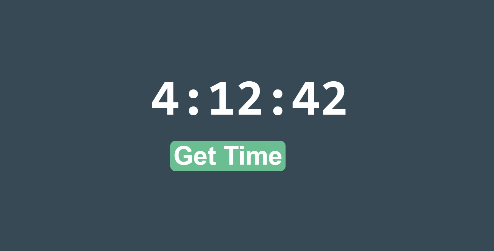

# Some Useful Layouts
Each folder or file is a seperate layout. For React layouts, download that particular folder and run the following commands after traversing inside that folder:<br>
```
npm install
```
<br>
Then to run the project:<br>
```
npm start
```

* Events layout page using HTML and CSS:<br>
<br>
* Timer Using React Hooks: <br><br>
<br><br>
* Changing State Using React: <br><br>
<br><br>
* Counter Using React Hooks: <br><br>
<br>
